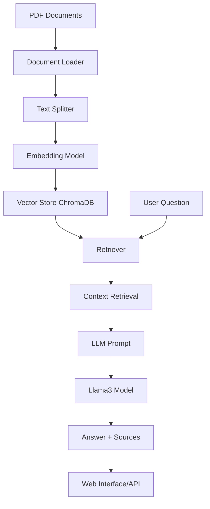

# RAG Chatbot - Interview Preparation Assistant

A Retrieval-Augmented Generation (RAG) chatbot designed to help with interview preparation. The bot uses your own documents (PDFs) as a knowledge base to answer questions accurately and cite sources.

## 🚀 Features

- **Document Ingestion**: Loads PDF documents from the `External Documents` directory
- **Smart Chunking**: Splits documents into meaningful chunks (800 chars with 150 chars overlap)
- **Vector Storage**: Stores embeddings in ChromaDB for efficient similarity search
- **Semantic Search**: Uses sentence-transformers/all-MiniLM-L6-v2 for embeddings
- **LLM Generation**: Powered by Ollama's Llama3 model for generating answers
- **Source Citation**: Returns relevant source documents with page numbers
- **Web Interface**: Clean, responsive UI built with FastAPI and vanilla JavaScript
- **REST API**: Simple `/chat` endpoint for programmatic access

## 🏗️ Architecture



### Pipeline Steps

1. **Data Ingestion**: Load PDF files using `PyPDFLoader`
2. **Chunking**: Split documents into chunks with `RecursiveCharacterTextSplitter` (chunk_size=800, overlap=150)
3. **Embedding**: Convert chunks to vectors using HuggingFace sentence-transformers
4. **Storage**: Persist vectors in ChromaDB
5. **Query Processing**: 
   - Embed user question
   - Retrieve top-k similar chunks (k=4)
   - Augment prompt with retrieved context
   - Generate answer using Llama3 via Ollama

## 🔧 Setup

### Prerequisites

- Python 3.8+
- [Ollama](https://ollama.com/) installed with Llama3 model (`ollama pull llama3`)
- Git

### Installation

1. Clone the repository:
   ```bash
   git clone <repository-url>
   cd Rag ChatBot
   ```

2. Create and activate virtual environment:
   ```bash
   python -m venv chatbot-venv
   source chatbot-venv/bin/activate  # Linux/Mac
   # or chatbot-venv\Scripts\activate  # Windows
   ```

3. Install dependencies:
   ```bash
   pip install -r requirements.txt
   ```

4. Place your PDF documents in the `External Documents` directory

## 📦 Usage

### 1. Ingest Documents

First, process your documents to create the vector database:

```bash
python ingest.py
```

This will:
- Load all PDFs from `External Documents`
- Split them into chunks
- Generate embeddings
- Store in `chroma_db` directory

### 2. Start the Server

```bash
python app.py
```

The server will start at `http://localhost:8000`

### 3. Use the Web Interface

Open your browser to `http://localhost:8000` and start asking questions!

### 4. API Usage

Send a POST request to `/chat`:

```bash
curl -X POST "http://localhost:8000/chat" \
  -H "Content-Type: application/json" \
  -d '{"message": "Your question here"}'
```

Response format:
```json
{
  "answer": "The generated answer based on your documents",
  "sources": [
    {
      "file": "document_name.pdf",
      "page": 5
    }
  ]
}
```

## 📚 Technologies Used

- **Framework**: FastAPI
- **Frontend**: HTML/CSS/Vanilla JS
- **Embeddings**: HuggingFace sentence-transformers/all-MiniLM-L6-v2
- **Vector Database**: ChromaDB
- **LLM**: Llama3 via Ollama
- **Document Processing**: LangChain (PyPDFLoader, RecursiveCharacterTextSplitter)
- **Environment**: Python 3.8+

## 📁 Project Structure

```
Rag ChatBot/
├── app.py                 # Main FastAPI application
├── ingest.py              # Document ingestion pipeline
├── requirements.txt       # Python dependencies
├── External Documents/    # Place your PDF files here
├── chroma_db/             # Vector database storage (created after ingestion)
├── templates/             # HTML templates
│   └── index.html
├── static/                # Static assets (CSS, JS)
│   ├── style.css
│   └── script.js
├── docker-compose.yaml    # Docker deployment
└── Dockerfile             # Container definition
```

## 🔮 Version 2: Traceable RAG (Planned Improvements)

- [ ] Add conversation history tracking
- [ ] Implement confidence scoring for answers
- [ ] Add feedback mechanism for answer quality
- [ ] Enhance source highlighting in UI
- [ ] Support for additional document formats (DOCX, TXT, MD)
- [ ] Query rephrasing for better retrieval
- [ ] Hybrid search (semantic + keyword)
- [ ] Monitoring and logging

## 🤝 Contributing

Contributions are welcome! Please feel free to submit a Pull Request.

## 📄 License

This project is licensed under the MIT License.

## 🙏 Acknowledgments

- LangChain team for excellent document processing tools
- HuggingFace for open-source embedding models
- Ollama for making LLMs accessible locally
- ChromaDB team for the vector database